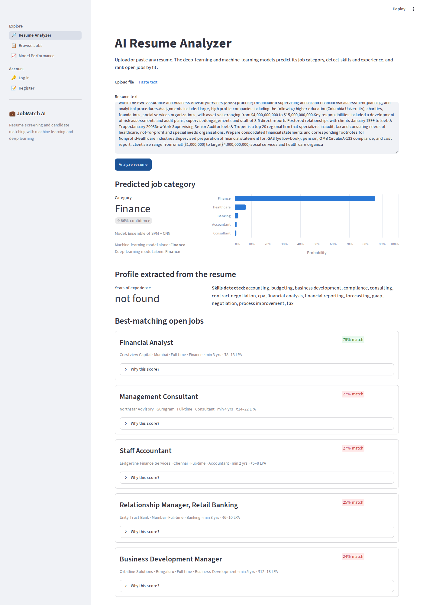

# JobMatch AI: Resume Screening and Candidate Matching with Machine Learning and Deep Learning

A Python project that reads resumes, predicts the job category they fit with machine learning and deep
learning, and ranks candidates for jobs (and jobs for candidates) with an explainable match score.
Delivered as a Streamlit web app with candidate, employer and admin roles.

**Final-year project: MBA (AI & Data Science), SRM Institute of Science and Technology.**



## Results

Trained on **2,481 real resumes in 24 job categories** and evaluated on **497 resumes the models never saw**.

| Model | Type | Test accuracy | Macro-F1 | Top-3 accuracy |
| --- | --- | --- | --- | --- |
| **Ensemble (Linear SVM + 1D-CNN)** | **Deployed** | **86.1%** | **80.9%** | **95.2%** |
| 1D-CNN (word embeddings + convolution) | Deep learning | 81.9% ± 1.0% | 75.8% | 91.5% |
| Linear SVM (TF-IDF) | Machine learning | 75.6% | 71.0% | 94.4% |
| Random Forest (TF-IDF) | Machine learning | 73.2% | 65.5% | 92.6% |
| Logistic Regression (TF-IDF) | Machine learning | 73.0% | 68.2% | 90.3% |
| MLP (TF-IDF) | Deep learning | 68.1% ± 0.1% | 64.1% | 85.9% |
| BiLSTM | Deep learning | 66.0% ± 1.8% | 57.1% | 76.7% |
| Naive Bayes (TF-IDF) | Machine learning | 61.0% | 53.7% | 87.9% |

Deep models: mean ± std over 3 seeds. The deployed model was chosen on validation data, not the test set.
For matching, **87%** of each job's top-10 ranked candidates come from the job's own category (CNN
embeddings 71% vs. TF-IDF 58% on their own). Full details: [`docs/PROJECT_REPORT.md`](docs/PROJECT_REPORT.md).


## Quick start

Needs Python 3.11 or 3.12. Step-by-step instructions for beginners: [`docs/SETUP_GUIDE.md`](docs/SETUP_GUIDE.md).

```bash
python -m venv .venv
.venv\Scripts\activate            # Mac/Linux: source .venv/bin/activate
pip install -r requirements.txt
streamlit run app.py              # opens http://localhost:8501
```

The trained models are included, and the first start creates a SQLite database with demo data.
Demo logins (password `demo1234`): candidate `ananya@example.com`, employer `talent@nimbus.example.com`,
admin `admin@example.com`.

```bash
python train.py                   # retrain all 7 models (~11 min on a laptop CPU; --quick ~4 min)
python evaluate_matching.py       # evaluate the matching engine
python docs/build_report.py       # refresh the report with the new numbers
python -m pytest                  # 39 tests
```

## What the app does

| Page | Who | What |
| --- | --- | --- |
| Resume Analyzer | Anyone | Upload PDF/DOCX/TXT or paste a resume → predicted category with probabilities, ML vs. DL views, detected skills and experience, best-matching jobs |
| Browse Jobs | Anyone | Search open jobs |
| Model Performance | Anyone | Every model's metrics and the evaluation charts |
| My Resume / Recommended Jobs / My Applications | Candidate | Upload a resume once, see all jobs ranked with explanations, apply, track status |
| Ranked Applicants / Find Candidates / Post a Job | Employer | Applicants sorted by AI score with a breakdown, status updates, search the whole candidate pool |
| Dashboard | Admin | Platform statistics, activate/deactivate users, job list |

## How it works

1. **Data:** LiveCareer resume dataset (CC0 licence), 2 duplicates removed.
2. **Preprocessing** (`jobmatch/text.py`): remove personal data, lowercase, strip symbols, repeat the
   resume headline to emphasise the job title.
3. **Machine learning** (`train.py`): TF-IDF (1–2 word n-grams) with Logistic Regression, Linear SVM, Naive
   Bayes and Random Forest, compared by 5-fold cross-validation.
4. **Deep learning** (`train.py`, Keras/TensorFlow): MLP, 1D-CNN and BiLSTM with early stopping, 3 seeds each.
5. **Ensemble:** average of the best ML and DL probabilities, deployed because it scored best on validation.
6. **Matching** (`jobmatch/matcher.py`): score = 40% category probability + 30% required skills found +
   20% CNN embedding similarity + 10% experience fit, each part shown to the user.

## Project structure

```
app.py                     Streamlit entry point (role-based navigation)
ui/                        Streamlit pages: public, candidate, employer, admin
jobmatch/                  Core package
  text.py                  preprocessing shared by training and the app
  models.py                loads the trained ML + DL models, predicts, embeds
  matcher.py               explainable job <-> candidate match score
  skills.py                multi-industry skills dictionary and matching
  experience.py            years-of-experience extraction
  resume_parser.py         PDF / DOCX / TXT text extraction
  db.py, auth.py           SQLite storage, salted password hashing
  seed.py                  demo accounts, jobs and applications
train.py                   trains and evaluates all models, saves the best
evaluate_matching.py       ranking evaluation of the matching engine
data/                      resumes.csv (dataset), jobs.json (24 demo jobs)
models/                    trained models (SVM pipeline, CNN, vocabulary, labels)
reports/                   metrics.json, matching_metrics.json, figures/
notebooks/                 Resume_Screening_ML_DL.ipynb (end-to-end walkthrough with outputs)
tests/                     pytest suite (text, skills, database, matcher, models, app pages)
docs/                      PROJECT_REPORT.md, VIVA_GUIDE.md, SETUP_GUIDE.md, screenshots/
experiments/               first iteration on a synthetic dataset (kept to document why it was dropped)
```

## Dataset and licence

Resumes: LiveCareer resume dataset, CC0 1.0 (public domain), via
[Hugging Face `opensporks/resumes`](https://huggingface.co/datasets/opensporks/resumes); the copy in
`data/` comes from the two-column working copy in
[MEND777-dev/job-category-classifier](https://github.com/MEND777-dev/job-category-classifier), in which
email addresses, links and phone numbers were already replaced (one remaining link was replaced here).
Company names in `data/jobs.json` and all demo users are fictional.
