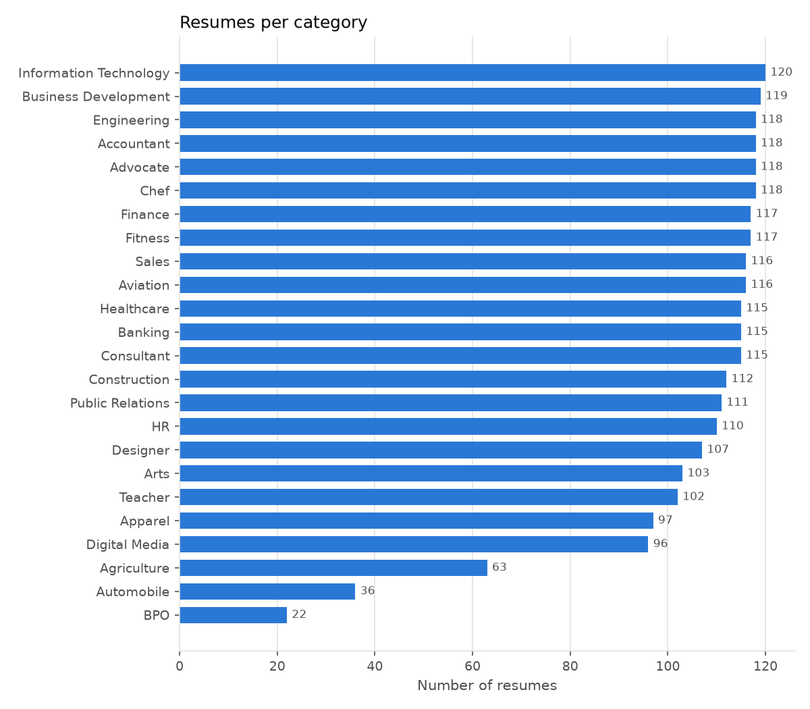
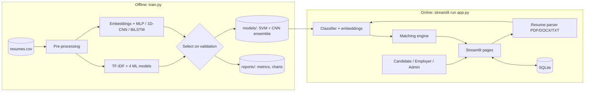
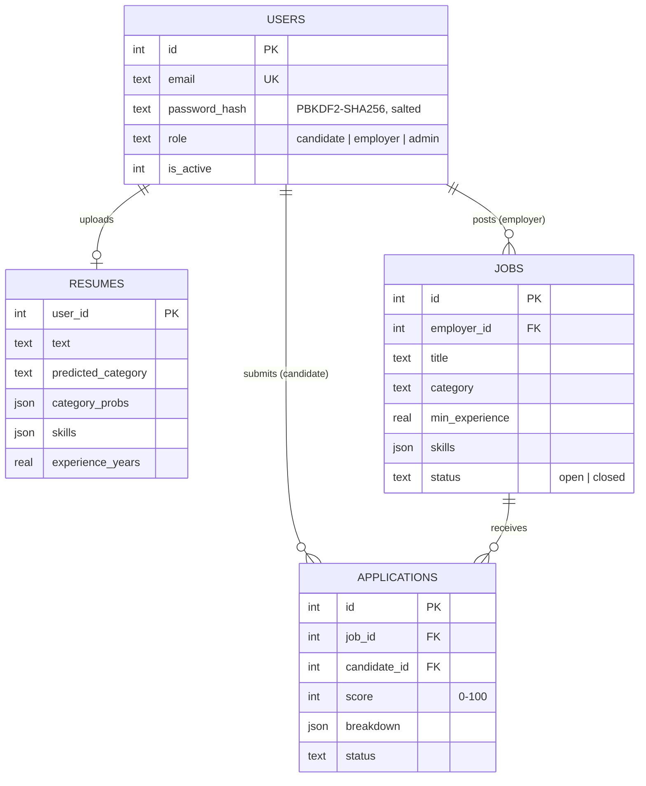
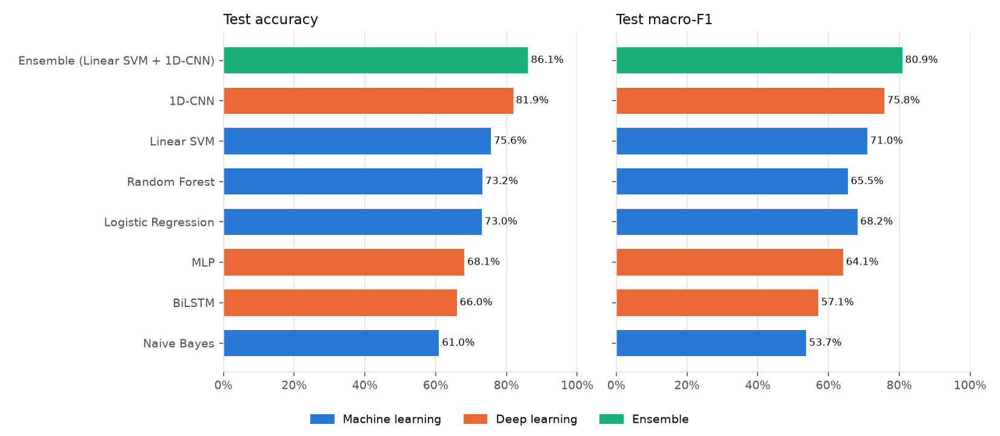
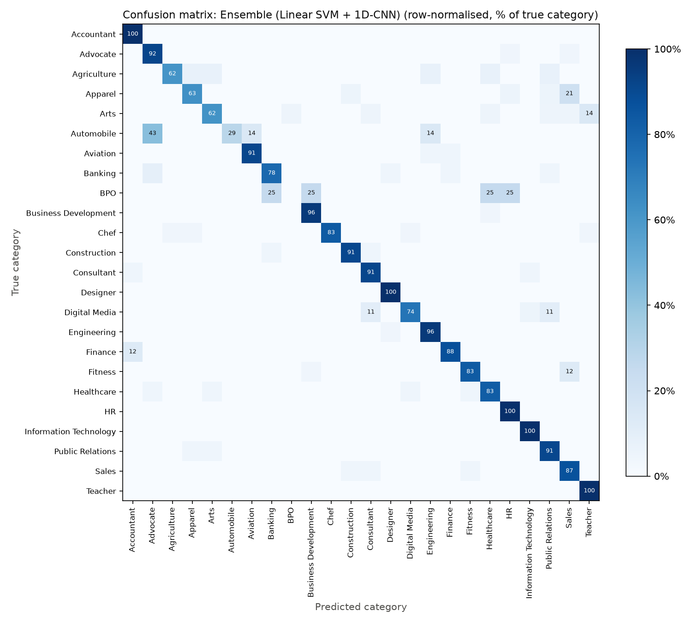
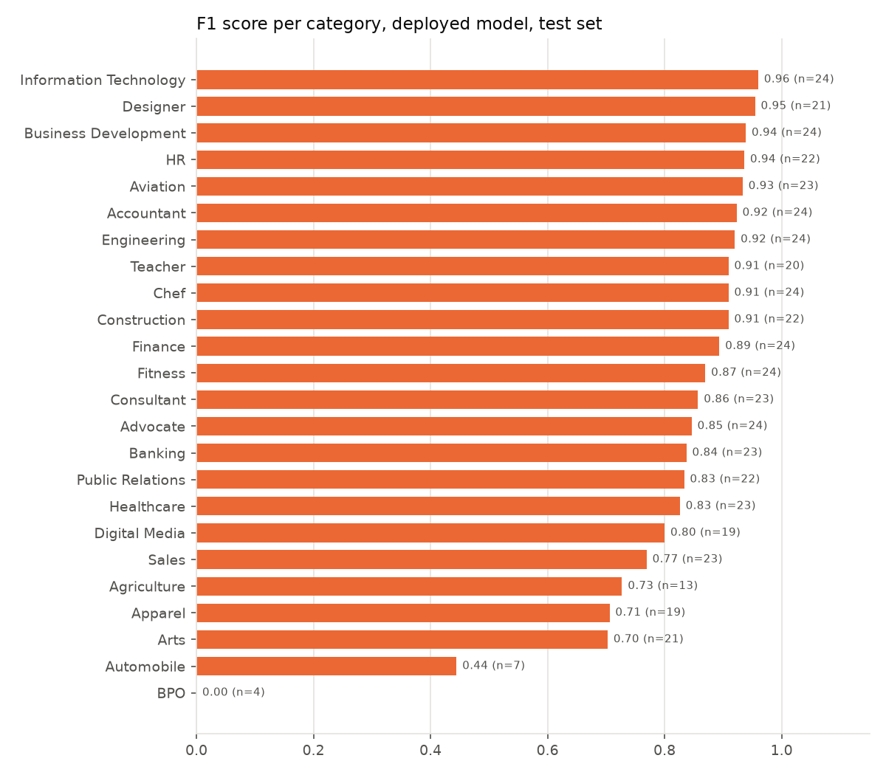
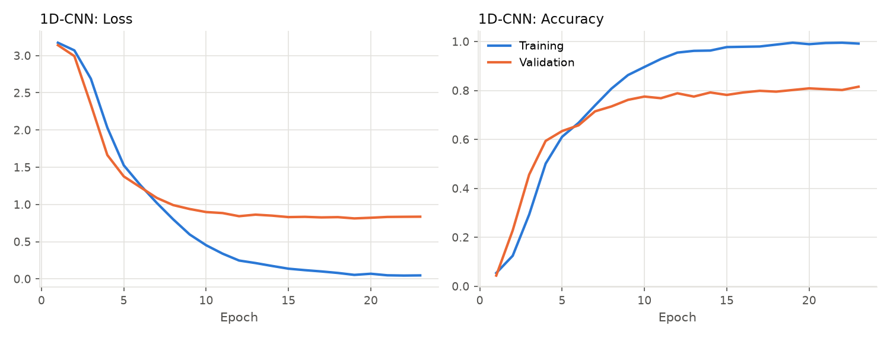
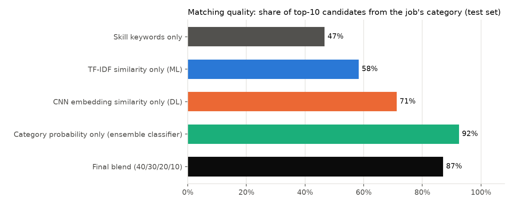

# AI-Based Resume Screening and Candidate Matching using Machine Learning and Deep Learning

**Final Year Project Report**

| | |
| --- | --- |
| Student | Samrudhi Dubal |
| Register No. | _[fill in]_ |
| Programme | MBA (AI & Data Science) |
| Institution | SRM Institute of Science and Technology |
| Guide | _[fill in]_ |
| Academic Year | _[fill in]_ |

---

## Abstract

Recruiters spend most of their screening time reading resumes that do not fit the role, while candidates
apply blindly without knowing which openings suit them. This project builds **JobMatch AI**, a Python web
application that screens resumes and matches candidates to jobs using machine learning (ML) and deep
learning (DL). Using 2,481 real resumes in 24 job categories (LiveCareer dataset,
CC0 licence), four ML classifiers (TF-IDF with Logistic Regression, Linear SVM, Naive Bayes and Random
Forest) and three DL architectures (a multilayer perceptron, a 1D convolutional neural network and a
bidirectional LSTM, built with Keras) were trained and compared under a leakage-free protocol: a held-out
test set, 5-fold cross-validation, and model selection on validation data only. The 1D-CNN was the best
single model (81.9% test accuracy, mean of 3 seeds) and an ensemble of the CNN and Linear SVM was
deployed, reaching **86.1% accuracy, 80.9% macro-F1 and 95.2% top-3 accuracy** on
497 unseen resumes. The models drive an explainable 0–100 match score that combines category
probability, skill overlap, CNN embedding similarity and experience. On unseen resumes, 87.1% of
each job's top-10 candidates come from the job's own category. The system is delivered as a Streamlit app
with candidate, employer and admin roles, a SQLite database, and an automated test suite.

**Keywords:** resume classification, candidate matching, NLP, TF-IDF, Linear SVM, convolutional neural
network, word embeddings, ensemble learning, Streamlit.

---

## 1. Introduction

### 1.1 Background
Online job portals have made applying easy and screening hard. A single opening can attract hundreds of
applications, and keyword-based Applicant Tracking Systems (ATS) are expensive and opaque: candidates are
filtered out without knowing why, and recruiters cannot see why a resume ranked where it did.

### 1.2 Problem statement
Build a system that (a) automatically identifies what kind of role a resume fits, (b) ranks candidates for
a job and jobs for a candidate with a score that can be explained, and (c) is evaluated honestly on data it
has never seen.

### 1.3 Objectives
1. Collect a real, legally usable resume dataset and check its quality.
2. Pre-process resume text (cleaning, removal of personal data, feature engineering).
3. Train and compare classical ML classifiers on TF-IDF features.
4. Train and compare deep-learning text classifiers (MLP, 1D-CNN, BiLSTM).
5. Select and deploy the best model without using the test set for selection.
6. Design an explainable job–candidate matching score and evaluate it quantitatively.
7. Deliver a working web application for candidates, employers and administrators.

### 1.4 Scope
The system classifies resumes into 24 industry categories and matches them to job postings. It does not
make hiring decisions; it supports a recruiter's first screening pass and helps candidates find relevant
jobs.

---

## 2. Literature Review

| Approach | Typical method | Strength | Weakness |
| --- | --- | --- | --- |
| Keyword ATS filters | Boolean search on skills | Simple, fast | Misses synonyms; opaque rejections |
| Bag-of-words + linear models | TF-IDF + Logistic Regression / SVM (Joachims, 1998) | Strong baseline for text; fast; interpretable | Ignores word order and phrase meaning |
| Naive Bayes | Word-probability model | Very fast; good with little data | Independence assumption hurts accuracy |
| Tree ensembles | Random Forest (Breiman, 2001) | Non-linear; robust | Slow and memory-hungry on sparse text |
| CNNs for text | Word embeddings + convolution (Kim, 2014) | Learns local phrase patterns; strong on classification | Needs more data; less interpretable |
| Recurrent networks | (Bi)LSTM (Hochreiter & Schmidhuber, 1997) | Models long-range order | Slow; hard to train on long documents |
| Pre-trained transformers | BERT / Sentence-BERT | State of the art semantics | Large models; need GPU or download of pre-trained weights |

**Data quality in published resume projects.** The most widely used Kaggle resume dataset (962 rows,
25 categories) contains only **166 unique resumes**; we verified this ourselves. Random splits put
copies of the same resume in training and test sets, which explains the ~99% accuracies often reported.
This project uses a different dataset with no meaningful duplication.

---

## 3. Dataset

| Property | Value |
| --- | --- |
| Source | LiveCareer resume dataset, published on Kaggle and Hugging Face (`opensporks/resumes`) |
| Licence | CC0 1.0 (public domain) |
| Size | 2,483 resumes, 2 exact duplicates removed → 2,481 |
| Labels | 24 categories (Accountant, Advocate, Agriculture, …, Teacher) |
| Text length | median 757 words |
| Personal data | Emails, links and phone numbers removed by the publisher and again by our cleaning |



Most categories have 100–120 resumes; **BPO (22)**, **Automobile (36)** and **Agriculture (63)** are
under-represented. Several categories overlap in vocabulary (e.g. Finance, Accountant, Banking), which
caps achievable accuracy.

**First iteration (documented in `experiments/`).** The project first used a 12,000-row synthetic
"talent recruitment" table. Every model, including Random Forest, scored ~33% on its three balanced
classes (chance level), and per-class feature distributions were identical: the labels carried no
signal. Recognising this and switching to real resume text was a key decision of the project.

---

## 4. Methodology

### 4.1 System architecture



### 4.2 Pre-processing (`jobmatch/text.py`)
1. **Personal-data removal:** URLs, email addresses and phone numbers are deleted.
2. **Normalisation:** lowercase; symbols removed except `+ # .` inside tokens (keeps *c++*, *c#*, *node.js*).
3. **Headline emphasis (feature engineering):** the first 8 words, which are usually the person's job
   title, are repeated three times. This raised Linear SVM accuracy from about 68% to 74% in development.

The same `prepare()` function is used in training and in the app, so predictions match training exactly
(verified by a unit test that reproduces the reported test accuracy from the saved models).

### 4.3 Evaluation protocol

```
2,481 resumes
├── test 20% (497)          touched once, for the reported numbers
└── train 80% (1,984)
    ├── 5-fold stratified cross-validation   compares the ML models
    └── fit 85% / validation 15%             early stopping for DL, choice of deployed model
```

Metrics: **accuracy**; **macro-F1** (the unweighted mean F1 over categories, so small categories count
equally); **weighted-F1**; **top-3 accuracy** (true category among the three most probable). Deep models
are trained with 3 random seeds and reported as mean ± standard deviation.

### 4.4 Machine-learning models
Features: TF-IDF over unigrams and bigrams (min document frequency 2, max 90%, sub-linear TF, English stop
words removed, up to 50,000 features).

| Model | Key settings |
| --- | --- |
| Logistic Regression | C = 10, multinomial |
| Linear SVM | C = 0.5, wrapped in 3-fold `CalibratedClassifierCV` to output probabilities |
| Complement Naive Bayes | α = 0.3 |
| Random Forest | 400 trees |

### 4.5 Deep-learning models (Keras 3 / TensorFlow)

| Model | Input | Architecture |
| --- | --- | --- |
| MLP | TF-IDF vector (20,000) | Dropout 0.3 → Dense 256 ReLU → Dropout 0.5 → Dense 128 ReLU → Dropout 0.3 → Softmax 24 |
| **1D-CNN** | 600 word IDs | Embedding 20,000×128 → Conv1D 128 filters, width 5, ReLU → Global max pooling → Dropout 0.5 → Dense 64 ReLU ("resume vector") → Softmax 24 |
| BiLSTM | 600 word IDs | Embedding 20,000×128 (masked) → Bidirectional LSTM 64 → Dropout 0.5 → Dense 64 ReLU → Softmax 24 |

Training: Adam optimiser, sparse categorical cross-entropy, batch size 32, up to 40 epochs, early stopping
on validation loss (patience 4, best weights restored).

**Why a CNN works well here:** each convolution filter learns to detect a 5-word phrase (e.g. *"accounts
payable and receivable"*, *"lesson plans for students"*) wherever it appears; max pooling keeps the
strongest match. Resume categories are signalled by such local phrases more than by long-range word order,
which is why the CNN beats the slower BiLSTM.

### 4.6 Ensemble and deployment choice
The probabilities of the best ML model (chosen by cross-validated macro-F1) and the best CNN (chosen by
validation macro-F1) are averaged. The deployed option, ML alone, DL alone or the ensemble, is whichever has
the highest **validation** macro-F1. Validation scores: ML 0.660, DL 0.745, ensemble 0.756 → **the ensemble** deployed.

### 4.7 Matching engine (`jobmatch/matcher.py`)

| Signal | Weight | Definition |
| --- | --- | --- |
| Category fit | 40% | Ensemble probability that the resume belongs to the job's category |
| Skill match | 30% | Required skills found in the resume ÷ required skills (word-boundary match with aliases, e.g. *MS Excel → excel*) |
| Semantic similarity | 20% | Cosine similarity between CNN "resume vectors" of resume and job text, rescaled from [0.40, 0.95] to [0, 1] |
| Experience fit | 10% | min(1, detected years ÷ job minimum); if no years are found, this weight is spread over the other signals |

```
score = 100 × Σ wᵢ·sᵢ / Σ wᵢ      (sum over available signals)
```

Every score is shown with its four components and the matched/missing skills, so recruiters can see why a
candidate ranks where they do. The same function ranks candidates for a job and jobs for a candidate.

### 4.8 Application (`app.py`, `ui/`)
- **Resume Analyzer** (no login): upload PDF/DOCX/TXT or paste text → predicted category with the top-5
  probabilities, the ML and DL models' individual views, detected skills and experience, and best-matching jobs.
- **Candidate:** upload a resume once; see all jobs ranked with explanations; apply; track applications.
- **Employer:** post jobs; see applicants ranked by match score with breakdown; change status
  (applied/shortlisted/rejected/hired); search the whole candidate pool for a job.
- **Admin:** platform statistics, candidate categories chart, activate/deactivate users, job list.
- **Model Performance:** all metrics and charts from training, inside the app.

### 4.9 Data model



A unique constraint on (job, candidate) prevents duplicate applications; deleting a job or user cascades
to its applications.

---

## 5. Results

### 5.1 Classification

| Model | Type | 5-fold CV accuracy | Test accuracy | Test macro-F1 | Test top-3 accuracy |
| --- | --- | --- | --- | --- | --- |
| Logistic Regression | Machine learning | 70.1% | 73.0% | 68.2% | 90.3% |
| Linear SVM | Machine learning | 70.9% | 75.6% | 71.0% | 94.4% |
| Naive Bayes | Machine learning | 61.2% | 61.0% | 53.7% | 87.9% |
| Random Forest | Machine learning | 71.4% | 73.2% | 65.5% | 92.6% |
| MLP | Deep learning (3 seeds) | — | 68.1% ± 0.1% | 64.1% ± 0.6% | 85.9% ± 0.8% |
| 1D-CNN | Deep learning (3 seeds) | — | 81.9% ± 1.0% | 75.8% ± 1.3% | 91.5% ± 0.4% |
| BiLSTM | Deep learning (3 seeds) | — | 66.0% ± 1.8% | 57.1% ± 1.8% | 76.7% ± 1.3% |
| **Ensemble (Linear SVM + 1D-CNN)** | Ensemble | — | **86.1%** | 80.9% | 95.2% |



**Findings**
- The **1D-CNN is the best single model**, ahead of every classical ML model.
- **Linear SVM** is the best ML model (by cross-validated macro-F1 and on the test set) and trains in
  seconds; Naive Bayes is the weakest model overall.
- The **BiLSTM** underperforms the CNN while being much slower: long resumes (600 tokens) make recurrent
  training harder, and phrase detection matters more than word order for this task.
- The **MLP on TF-IDF** does not beat linear models on the same features: with ~1,700 training resumes,
  extra layers mostly add variance.
- The **ensemble** improves on both of its members because the SVM and CNN make different mistakes.
- **Top-3 accuracy of 95.2%** shows the right category is almost always among the first three guesses.

### 5.2 Error analysis





The most frequent confusions on the test set are **Apparel → Sales**, **Fitness → Sales**, **Finance →
Accountant**, **Automobile → Advocate**, **Arts → Teacher** and **Digital Media → Public Relations /
Consultant**. Many of these resumes describe genuinely mixed careers (for example, retail apparel staff
whose work is mostly selling; artists who teach). The smallest categories suffer most: **BPO** (22 resumes
in total, only 4 in the test set) is never predicted correctly (F1 = 0) and **Automobile** reaches only
F1 = 0.44. More examples of these categories, or merging BPO into a broader customer-service category,
would be needed. Because a resume can fit several categories, the matcher uses the full probability
distribution rather than a single predicted label.



Training accuracy climbs to about 99% while validation accuracy levels off near 80%, and validation loss
stops improving after about 12 epochs even though training loss keeps falling towards zero. This gap is
overfitting: the network starts memorising the training resumes. Early stopping ends training once
validation loss stops improving and restores the best weights; dropout (50%) limits the gap.

### 5.3 Matching

There are no human relevance labels for (job, resume) pairs, so a resume is treated as relevant to a job
when it is from the job's category. All 497 test resumes are ranked for each of the 24 jobs.

| Ranking signal | Precision@10 | Precision@20 | MAP |
| --- | --- | --- | --- |
| Skill keywords only | 46.7% | 37.1% | 0.349 |
| TF-IDF similarity only (ML) | 58.3% | 51.2% | 0.512 |
| CNN embedding similarity only (DL) | 71.2% | 62.1% | 0.648 |
| Category probability only (ensemble classifier) | 92.5% | 83.3% | 0.876 |
| Final blend (40/30/20/10) | 87.1% | 77.9% | 0.801 |



- The **deep-learning embedding** ranks candidates far better than classical **TF-IDF** similarity.
- Skill keywords alone are the weakest signal (many resumes phrase skills differently), but they are the
  most transparent, so they keep a 30% weight.
- The final blend keeps most of the category signal's precision while adding verifiable skills and
  experience. Average final score: 60 for resumes from the job's category vs. 22
  for others.
- Weight sensitivity (computed on validation resumes, not the test set):

| Category / Skills / Semantic / Experience | Precision@10 | MAP |
| --- | --- | --- |
| 40% / 30% / 20% / 10% | 87.1% | 0.885 |
| 50% / 20% / 20% / 10% | 89.2% | 0.956 |
| 30% / 40% / 20% / 10% | 79.6% | 0.803 |
| 30% / 30% / 30% / 10% | 83.3% | 0.840 |
| 25% / 25% / 25% / 25% | 83.3% | 0.816 |

  A higher category weight scores better here, but this benchmark defines relevance *as* category
  membership, so it always favours the category signal; taken to the limit it would recommend ignoring
  skills entirely. The weights were therefore set by design (category strongest, then concrete skills,
  then semantic similarity, then experience), not tuned to this proxy.

> *Caveat:* the relevance proxy rewards the category signal by construction. Within a category, ranking
> depends on skills and experience, which this proxy cannot measure; a study with recruiter judgements
> would be needed.

---

## 6. Testing

| Suite | Tests | Covers |
| --- | --- | --- |
| `tests/test_text_skills_experience.py` | 10 | Personal-data removal, headline emphasis, multi-industry skills, aliases, word boundaries, experience extraction |
| `tests/test_db_auth.py` | 5 | Password hashing, registration, login, deactivation, duplicate prevention, cascading deletes, statistics |
| `tests/test_matcher.py` | 6 | Score formula, weight redistribution, missing signals, bounds |
| `tests/test_models.py` | 3 | Obvious resumes classified correctly; saved models reproduce the reported test accuracy; embeddings are meaningful |
| `tests/test_app.py` | 15 | The Streamlit app runs headlessly and predicts a pasted resume; all 11 pages render for their role; role pages are blocked for other users |

39 tests in total. Run with `python -m pytest`.

---

## 7. Limitations and Future Work

**Limitations**
- Categories are broad industries, not specific roles; several overlap.
- The dataset is US-centric (LiveCareer); Indian resumes may use different vocabulary.
- Matching quality is measured with a category proxy rather than recruiter judgements.
- Skill matching is lexical and misses paraphrases not in the alias table.
- Scanned (image-only) PDFs contain no extractable text.
- Like any model trained on historical data, it could reflect biases in that data; it should support, not
  replace, human decisions.

**Future work**
- Fine-tune a pre-trained transformer (BERT / Sentence-BERT) for classification and semantic matching.
- Learn matching weights from recruiter outcomes (shortlisted / hired) with learning-to-rank.
- Named-entity recognition for skills, degrees and employers instead of dictionaries.
- OCR for scanned resumes; multilingual support.
- Fairness audit of scores across demographic groups.

---

## 8. Conclusion

The project shows that deep learning improves resume screening over classical ML on real data: a 1D-CNN
with learned word embeddings beat four ML models, and an ensemble of the CNN and a Linear SVM reached
86.1% accuracy and 95.2% top-3 accuracy on unseen resumes. Equally important were the data
decisions: rejecting a synthetic dataset with no signal, avoiding a duplicated dataset that inflates
accuracy, and selecting models on validation data only. The trained models power an explainable matching
engine and a complete Streamlit application that candidates, employers and administrators can use today.

---

## References

1. T. Joachims, "Text categorization with Support Vector Machines," *ECML*, 1998.
2. Y. Kim, "Convolutional Neural Networks for Sentence Classification," *EMNLP*, 2014.
3. S. Hochreiter and J. Schmidhuber, "Long Short-Term Memory," *Neural Computation*, 9(8), 1997.
4. L. Breiman, "Random Forests," *Machine Learning*, 45, 2001.
5. G. Salton and C. Buckley, "Term-weighting approaches in automatic text retrieval," *Information Processing & Management*, 24(5), 1988.
6. F. Pedregosa et al., "Scikit-learn: Machine Learning in Python," *JMLR*, 12, 2011.
7. F. Chollet et al., Keras, https://keras.io
8. LiveCareer resume dataset (CC0 1.0): https://huggingface.co/datasets/opensporks/resumes
9. Streamlit documentation: https://docs.streamlit.io
