# JobMatch AI: A Full-Stack Job Portal with AI-Based Resume Screening and Candidate Matching

**Final Year Project Report**

| | |
| --- | --- |
| Student | Samrudhi Dubal |
| Register No. | _[fill in]_ |
| Department | _[fill in, e.g. Computer Science and Engineering]_ |
| Institution | SRM Institute of Science and Technology |
| Guide | _[fill in]_ |
| Academic Year | _[fill in]_ |

---

## Abstract

Recruiters routinely receive hundreds of applications for a single opening and
spend most of their time manually reading resumes that do not fit the role.
Candidates, in turn, apply blindly without knowing which openings actually
match their profile. **JobMatch AI** is a full-stack web application (MongoDB,
Express, React, Node.js) that addresses both problems. Employers post jobs
with required skills and an experience level; candidates apply by uploading a
resume (PDF, DOCX, DOC or TXT). The server extracts the resume text and an
explainable AI matching engine scores the candidate from 0 to 100 using three
signals: **skill overlap** (with a synonym/alias table, e.g. "js" →
"javascript", "k8s" → "kubernetes"), **TF cosine text similarity** between
resume and job description, and **experience fit** derived from years of
experience detected in the resume. Applicants are ranked automatically, with
matched and missing skills shown to the employer. The same engine powers
**two-way candidate matching**: candidates get a ranked "Recommended for You"
list of open jobs with a skill-gap analysis, and employers can search the
whole candidate pool, including people who have not applied. An optional
LLM layer (Anthropic Claude) can be enabled to add a qualitative fit summary.
The system includes role-based access control (candidate, employer, admin),
email notifications, an admin dashboard and an automated test suite
(unit, integration and UI component tests).

**Keywords:** resume screening, candidate matching, job recommendation, NLP,
cosine similarity, MERN stack, explainable AI.

---

## 1. Introduction

### 1.1 Background
Online job portals have made applying easy, which has made screening hard.
Applicant Tracking Systems (ATS) used by large companies are expensive and
often opaque: a candidate is rejected by a keyword filter without knowing why.
Smaller organisations and campus placement cells usually screen manually.

### 1.2 Problem Statement
Design and build a job portal that (a) automatically screens and ranks
applicants against a job's requirements, (b) explains each score so the
decision is transparent, and (c) recommends suitable jobs to candidates and
suitable candidates to employers, without depending on a paid external AI
service.

### 1.3 Objectives
1. Provide secure, role-based access for candidates, employers and admins.
2. Let employers create, edit, close and delete job postings with required
   skills and experience level.
3. Let candidates search and filter jobs and apply with a resume upload.
4. Extract text from PDF/DOCX/DOC/TXT resumes on the server.
5. Score every application 0–100 with an explainable, locally-running AI
   engine and rank applicants by score.
6. Recommend jobs to candidates and matching candidates to employers.
7. Notify users by email on key events.
8. Give administrators platform-wide statistics and moderation tools.
9. Verify the system with automated unit, integration and UI tests.

### 1.4 Scope
The project targets small-to-medium recruiters and university placement
cells. It runs fully offline (no API keys required). Video interviews,
payments and chat are out of scope.

---

## 2. Literature Survey / Existing Systems

| System | Approach | Limitation addressed by JobMatch AI |
| --- | --- | --- |
| Generic job boards (Naukri, Indeed) | Keyword search, manual screening by recruiter | No per-application fit score visible to small recruiters |
| Enterprise ATS (Workday, Taleo) | Keyword/boolean filters | Expensive; rejections are opaque to candidates and recruiters |
| Pure keyword matching | Exact string match of skills | Misses synonyms ("JS" vs "JavaScript"), ignores context |
| Black-box ML/LLM ranking | Learned embeddings or LLM prompts | Hard to explain; needs training data or paid APIs |

**Techniques used in this project and why:**
- **Bag-of-words + TF cosine similarity** is a classic information-retrieval
  method (Salton's Vector Space Model). It is fast, needs no training data
  and is easy to explain in terms of shared vocabulary.
- **Dictionary-based skill extraction with an alias table** gives
  deterministic, auditable skill detection and handles common synonyms.
- **Rule-based experience extraction** (regular expressions over phrases like
  "5 years of experience") gives a transparent experience signal.
- **Optional LLM scoring** is kept as an additive, opt-in layer so the core
  system stays explainable and free to run.

---

## 3. System Requirements

### 3.1 Functional Requirements
| ID | Requirement |
| --- | --- |
| FR1 | Users register as candidate or employer and log in with email/password |
| FR2 | Employers create, update, close/reopen and delete their job postings |
| FR3 | Anyone can browse and filter open jobs by keyword, location, type, level, skill |
| FR4 | Candidates apply to an open job by uploading a resume and optional cover letter |
| FR5 | The system extracts resume text and computes an AI match score with a breakdown |
| FR6 | Employers see applicants ranked by match score and update application status |
| FR7 | Candidates see their applications, scores and statuses |
| FR8 | Candidates see recommended jobs with matched and missing skills |
| FR9 | Employers see all platform candidates ranked for a job, flagged applied/not applied |
| FR10 | Candidates upload a profile resume independently of applying |
| FR11 | Email notifications on application submitted, status change, new applicant |
| FR12 | Admins view statistics, manage users (activate/deactivate/delete) and moderate jobs |

### 3.2 Non-Functional Requirements
- **Security:** bcrypt password hashing, JWT authentication, role-based
  authorisation, deactivated accounts blocked, resumes never served publicly.
- **Explainability:** every score shows its component percentages and the
  matched/missing skills.
- **Performance:** scoring is in-memory and runs in milliseconds per resume.
- **Portability:** runs on any OS with Node.js 18+ and MongoDB.
- **Testability:** automated unit, integration and UI tests.

### 3.3 Hardware / Software
- **Software:** Node.js 18+, MongoDB 6+, a modern browser.
- **Hardware:** any machine with 4 GB RAM.

---

## 4. System Design

### 4.1 Architecture

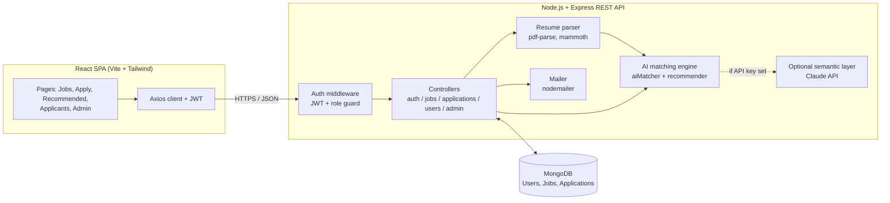

The application follows a three-tier architecture: a React single-page
application (presentation), an Express REST API (business logic) and MongoDB
(data). The AI engine is a set of pure functions inside the API, which makes
it easy to unit-test.

### 4.2 Data Model (ER Diagram)

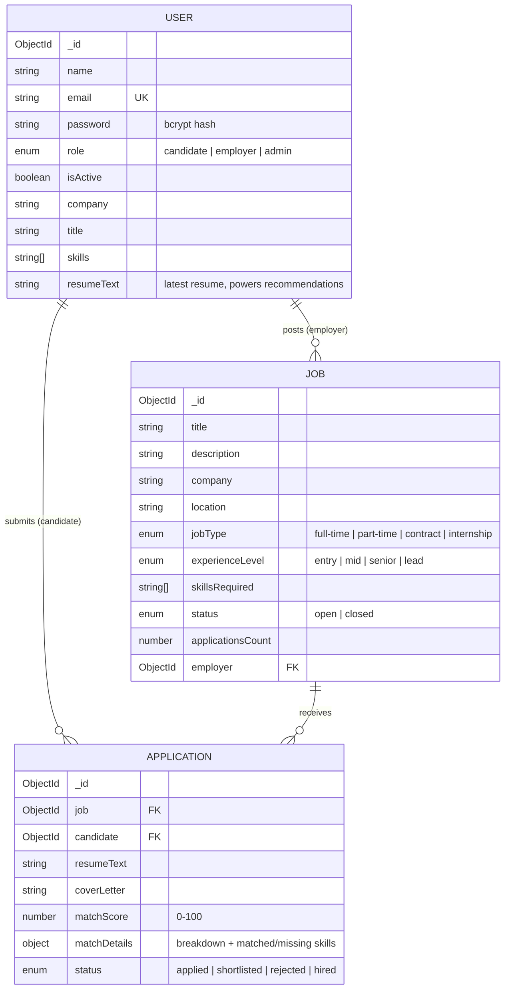

A compound unique index on `(job, candidate)` prevents duplicate applications.
A text index on job title, description and company powers keyword search.

### 4.3 Use Cases

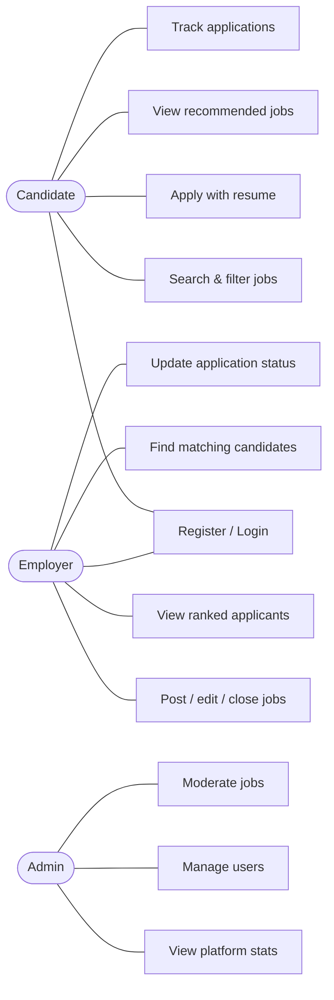

### 4.4 Application Flow (Sequence)

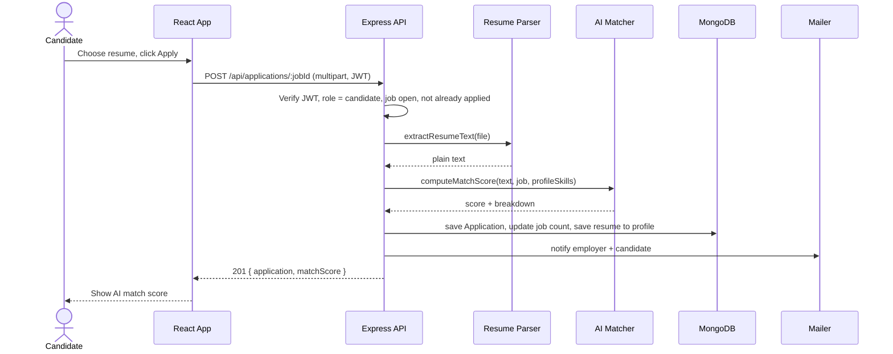

---

## 5. The AI Matching Engine

Source: `backend/utils/aiMatcher.js`, `backend/utils/recommender.js`.

### 5.1 Pre-processing
1. **Text extraction:** `pdf-parse` for PDF, `mammoth` for DOCX, UTF-8 read
   for TXT/DOC.
2. **Tokenisation:** lowercase, strip punctuation (keeping `+ . #` so that
   `c++`, `node.js`, `c#` survive), split on whitespace.
3. **Stopword removal:** common English words ("the", "and", "with", …) are
   dropped.

### 5.2 Signal 1: Skill Match (weight 50%)
Skills are detected in the resume by matching a curated dictionary of 150+
technical skills with word-boundary regular expressions. Every skill,
both detected and required, is mapped to a canonical name through an
alias table (`js → javascript`, `react → react.js`, `aws → amazon web
services`, `k8s → kubernetes`, …). The candidate's declared profile skills are
merged in.

```
skillMatch% = |required ∩ candidate| / |required| × 100
```

### 5.3 Signal 2: Text Similarity (weight 25%)
Resume and job text (title + description + skills) are converted to term
frequency vectors **A** and **B** over their combined vocabulary:

```
cosine(A, B) = (A · B) / (‖A‖ × ‖B‖)
textSimilarity% = cosine × 100
```

This rewards resumes that are topically aligned with the job even when the
skill keywords differ.

### 5.4 Signal 3: Experience Fit (weight 25%)
Regular expressions detect phrases like "5 years of experience" or "3+ yrs"
and take the largest figure. Each level has a minimum: entry 0, mid 2,
senior 5, lead 8 years.

```
experienceFit% = 100                          if years ≥ minimum
               = years / minimum × 100        otherwise
               = unknown (null)               if no years are mentioned
```

### 5.5 Final Score

```
score = 0.50 × skillMatch + 0.25 × textSimilarity + 0.25 × experienceFit
```

If experience is unknown, its 25% is redistributed proportionally across the
other two signals (≈ 66.7% skill, 33.3% text), so candidates are not penalised
for omitting it. Education level (PhD, Master's, Bachelor's, …) is detected
and shown to the employer but is deliberately **not** scored.

**Optional LLM layer:** if `ANTHROPIC_API_KEY` is set, Claude returns a 0–100
fit score and a one-paragraph summary. The stored score becomes
`0.7 × local + 0.3 × LLM`. If the call fails or no key is set, the local score
is used unchanged.

### 5.6 Worked Example (from the demo data)
Job: **Senior DevOps Engineer**, level senior, skills `aws, docker,
kubernetes, terraform, jenkins`. Candidate **Karthik Nair** resume mentions
all five skills and "6 years of experience".

| Signal | Value | Weighted |
| --- | --- | --- |
| Skill match | 5/5 = 100% | 50.0 |
| Text similarity | 42% | 10.5 |
| Experience fit | 6 ≥ 5 → 100% | 25.0 |
| **Score** | | **86%** |

### 5.7 Two-Way Candidate Matching
`recommender.js` reuses the same engine in bulk:
- **Recommended jobs (candidate):** scores every open job against the
  candidate's saved resume, or, if they have not uploaded one, a profile
  document built from headline, bio and skills. Results are sorted by score
  and show "You have" / "To learn" skill lists, a simple skill-gap analysis.
- **Matching candidates (employer):** scores every active candidate for a job
  and flags whether each one has already applied, so recruiters can reach
  out to strong candidates proactively. Candidates with an empty profile are
  skipped; raw resume text is never sent to the employer through this
  endpoint.

### 5.8 Why this design
- **Explainable:** each score decomposes into understandable parts.
- **No training data needed:** works from day one.
- **Free and private:** runs locally; resumes never leave the server unless
  the optional LLM layer is enabled.
- **Fair by default:** education is informational only, and missing
  experience is neutral.

---

## 6. Implementation

### 6.1 Technology Stack
| Layer | Technology |
| --- | --- |
| Frontend | React 18, Vite, React Router, Tailwind CSS, Axios |
| Backend | Node.js, Express 4 |
| Database | MongoDB with Mongoose ODM |
| Auth | JSON Web Tokens, bcryptjs |
| File upload / parsing | Multer (5 MB limit, extension whitelist), pdf-parse, mammoth |
| Email | Nodemailer (SMTP or console fallback) |
| Optional AI | Anthropic Claude via `@anthropic-ai/sdk` |
| Testing | Jest, Supertest, mongodb-memory-server, Vitest, React Testing Library |

### 6.2 Modules
1. **Authentication & authorisation:** `authController`, `middleware/auth.js`
   (`protect` verifies the JWT and that the account is active; `authorize`
   restricts by role).
2. **Job management:** `jobController`, CRUD with ownership checks,
   search/filter with pagination.
3. **Application & screening:** `applicationController`, upload → parse →
   score → store → notify.
4. **Recommendation & matching:** `recommender.js`,
   `GET /api/jobs/recommended`, `GET /api/jobs/:id/matching-candidates`.
5. **Profile:** `userController`, profile edits and profile resume upload.
6. **Notifications:** `mailer.js`.
7. **Administration:** `adminController`, stats, user and job moderation,
   cascading deletes.

### 6.3 REST API Summary
See the API Overview table in the root `README.md` for every endpoint, its method and the role allowed to call it.

### 6.4 Security Measures
- Passwords hashed with bcrypt (10 salt rounds) and excluded from queries by
  default (`select: false`).
- Stateless JWT auth; every protected request re-checks that the user still
  exists and is active.
- Admins cannot self-register; the first admin is created by a seed script.
- Ownership checks on every job/application mutation.
- Upload whitelist (`.pdf .docx .doc .txt`) and a 5 MB size limit;
  filenames sanitised.
- Resume files are not exposed as static files (PII).

---

## 7. Testing

| Suite | Tool | Count | What it covers |
| --- | --- | --- | --- |
| Backend unit | Jest | 44 | Matching engine, skill aliasing, experience/education parsing, recommender, auth middleware, mailer, LLM layer (mocked) |
| Backend integration | Jest + Supertest + in-memory MongoDB | 25 | Full HTTP API: register/login, role guards, job CRUD, apply + scoring, duplicate prevention, ranking, status updates, recommendations, candidate matching, profile resume upload, admin actions |
| Frontend | Vitest + React Testing Library | 22 | MatchScoreBadge, JobCard, PrivateRoute, AuthContext, Login, RecommendedJobs |

Run with `cd backend && npm test` and `cd frontend && npm test`.

### Sample Test Cases
| # | Test case | Input | Expected | Result |
| --- | --- | --- | --- | --- |
| 1 | Candidate cannot post job | POST /api/jobs with candidate token | 403 | Pass |
| 2 | Apply computes score | Upload sample resume to job | 201, score 0–100 with breakdown | Pass |
| 3 | Duplicate application | Apply twice | 409 | Pass |
| 4 | Ranked applicants | GET applicants as owner | Sorted by score desc | Pass |
| 5 | Non-owner blocked | Other employer views applicants | 403 | Pass |
| 6 | Alias resolution | Resume says "JS", job needs "javascript" | Counted as match | Pass |
| 7 | Unknown experience is neutral | No years in resume | Weight redistributed | Pass |
| 8 | Recommendations | Candidate with saved resume | Best-fitting job first | Pass |
| 9 | Matching candidates | Employer for own job | Ranked list, applicants flagged, no resume text leaked | Pass |
| 10 | Deactivated user | Admin deactivates, user logs in | 403 | Pass |

---

## 8. Results

Demo data (`npm run seed:demo`) produces the following scores, which line up
with what a human recruiter would judge:

| Candidate | Job | Score | Notes |
| --- | --- | --- | --- |
| Ananya (MERN, 3 yrs) | MERN Stack Developer (mid) | 86% | All 5 skills, experience fits |
| Sneha (fresher, frontend) | Frontend Developer Intern | 81% | All skills, entry level |
| Sneha (fresher, frontend) | MERN Stack Developer (mid) | 37% | Missing backend skills, under-experienced |
| Rahul (Data Scientist, 5 yrs) | Machine Learning Engineer | 83% | Strong skill + text match |
| Karthik (DevOps, 6 yrs) | Senior DevOps Engineer | 86% | All skills, exceeds seniority |

### Screenshots
| | |
| --- | --- |
| 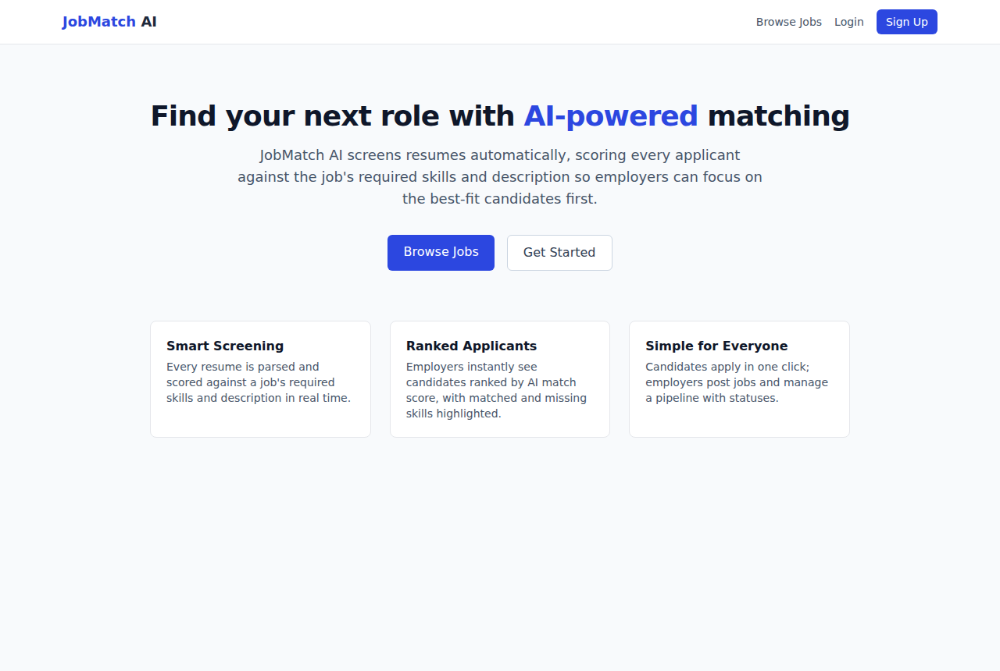 Home | 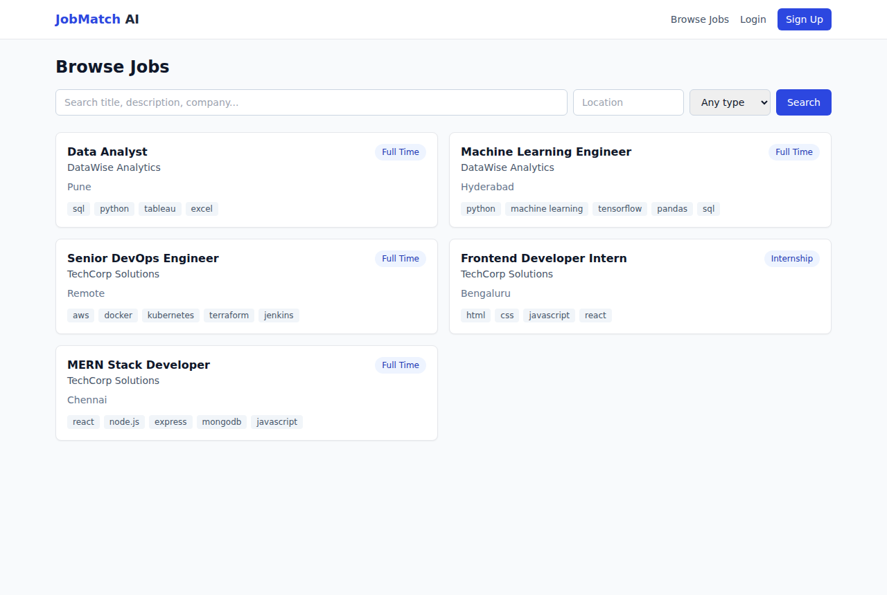 Browse jobs |
| 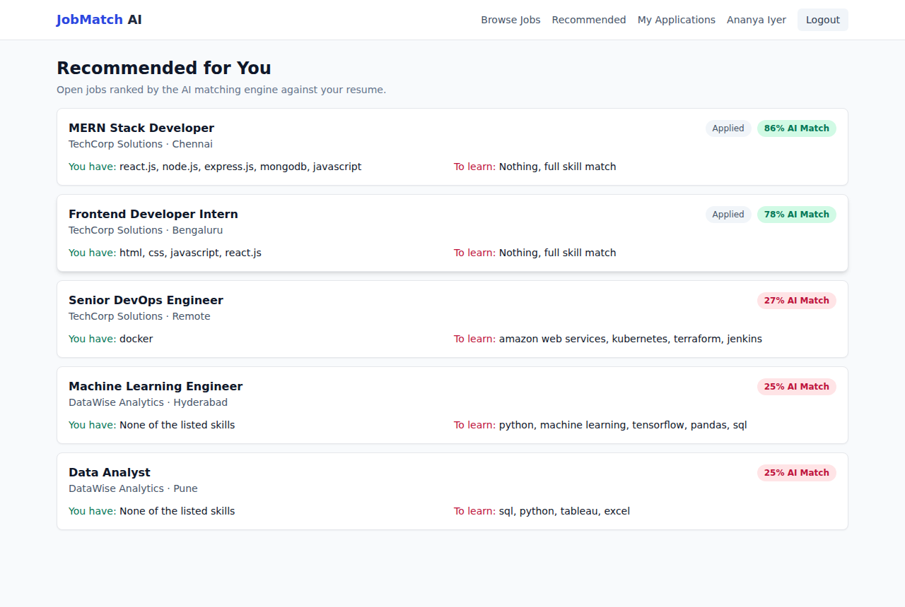 Candidate: recommended jobs | 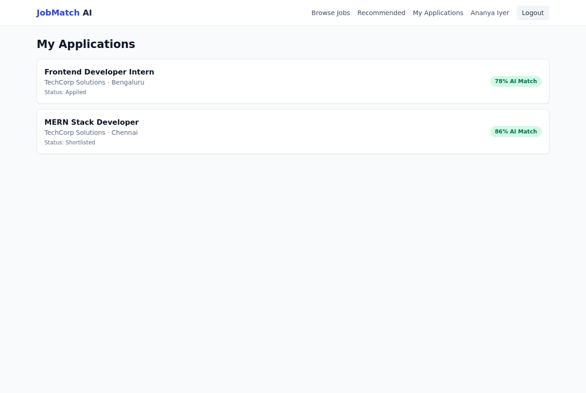 Candidate: my applications |
| 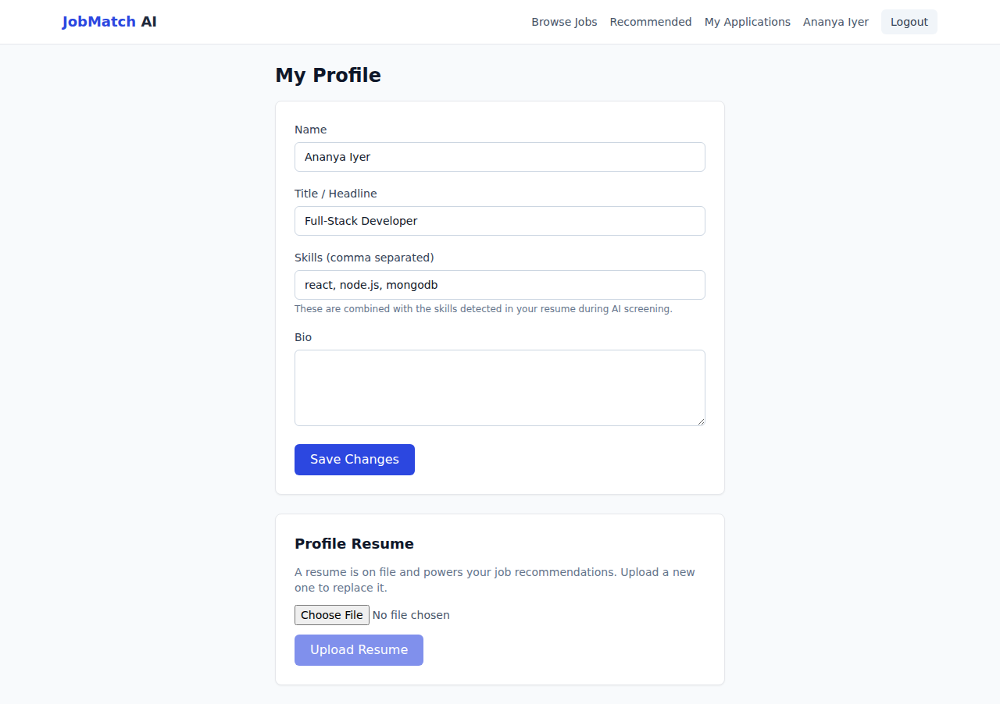 Candidate: profile + resume upload | 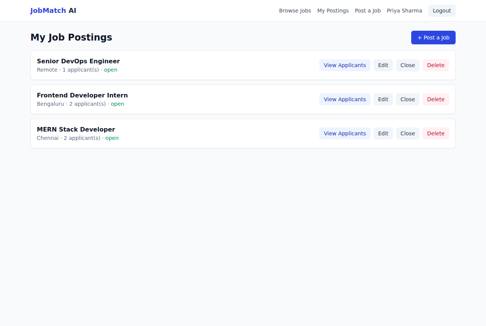 Employer: my postings |
| 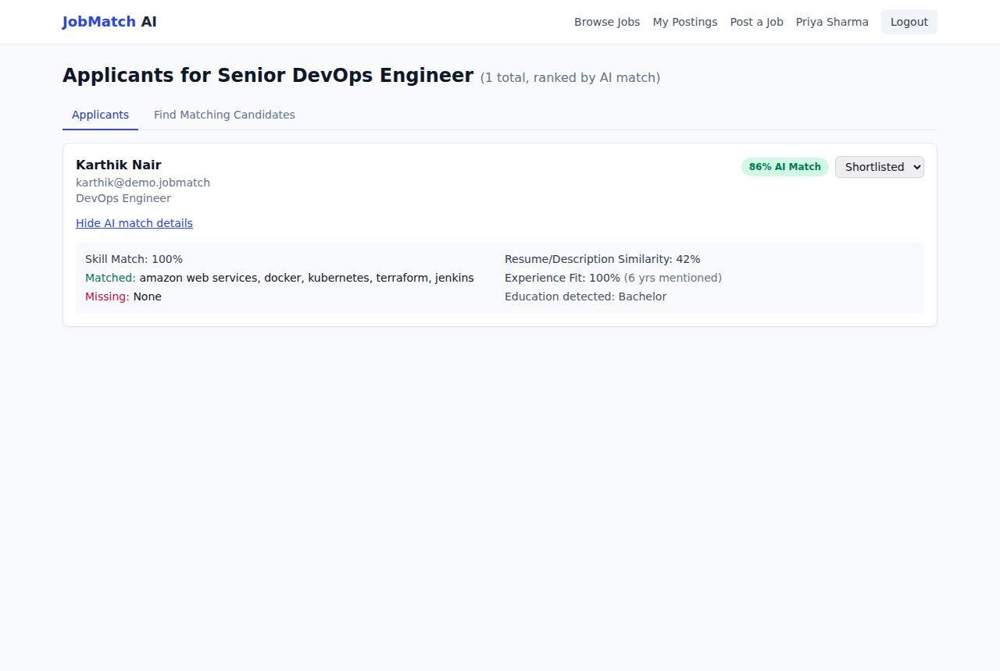 Employer: ranked applicants with AI breakdown | 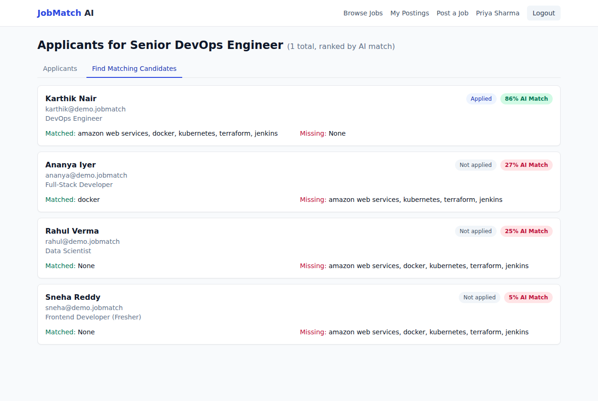 Employer: find matching candidates |
| 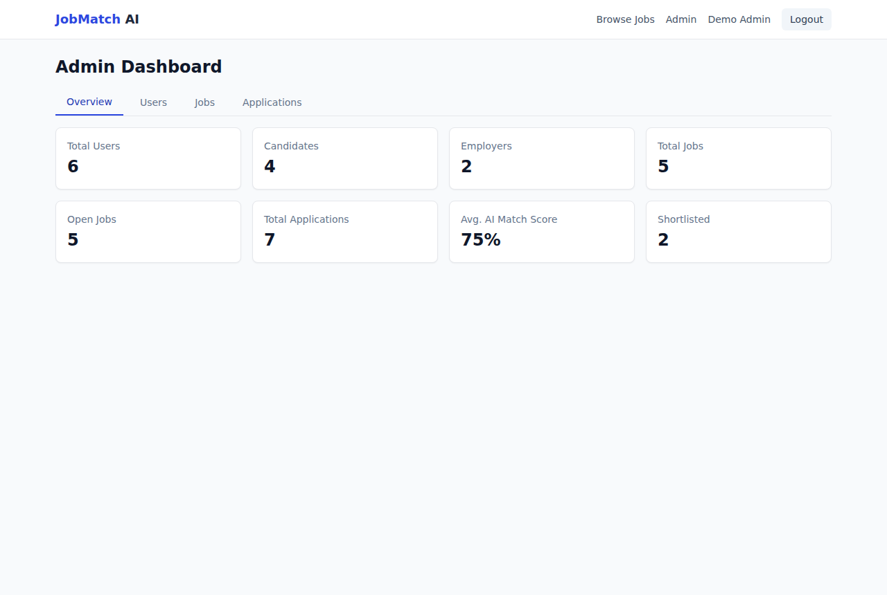 Admin dashboard | |

---

## 9. Limitations and Future Enhancements

**Limitations**
- Skill detection is dictionary-based; skills absent from the dictionary are
  only captured through text similarity.
- TF cosine similarity does not understand meaning ("ML" vs "statistical
  modelling" share no tokens).
- Scanned (image-only) PDFs have no extractable text.
- Bulk matching scores every candidate per request, which is fine for
  thousands of profiles but would need caching or a vector index at larger
  scale.

**Future work**
- Sentence embeddings (e.g. Sentence-BERT) with a vector database for
  semantic search.
- TF-IDF weighting and learning the signal weights from recruiter decisions
  (shortlisted/hired as labels).
- OCR (Tesseract) for scanned resumes.
- Interview scheduling, in-app messaging, and resume improvement tips
  generated from the skill gap.
- Bias auditing dashboard comparing score distributions.

---

## 10. Conclusion

JobMatch AI shows that a transparent, rule-plus-statistics AI engine can
meaningfully automate first-round resume screening without a paid AI service
or training data. Every score is explainable: employers see exactly which
skills matched and why, and candidates see which skills to learn to qualify
for a job. Reusing one engine for screening, job recommendation and
candidate search keeps the system consistent, and the automated test suite
checks that each feature works as specified.

---

## References
1. G. Salton, A. Wong, C. S. Yang, "A Vector Space Model for Automatic
   Indexing," *Communications of the ACM*, 18(11), 1975.
2. C. D. Manning, P. Raghavan, H. Schütze, *Introduction to Information
   Retrieval*, Cambridge University Press, 2008.
3. MongoDB Documentation: https://www.mongodb.com/docs/
4. Express.js Documentation: https://expressjs.com/
5. React Documentation: https://react.dev/
6. RFC 7519, JSON Web Token (JWT): https://datatracker.ietf.org/doc/html/rfc7519
7. Anthropic API Documentation: https://docs.anthropic.com/
