# JobMatch AI: Full-Stack Job Portal with AI-Based Resume Screening and Candidate Matching (Python)

A full-stack web application written in **Python**. Job seekers upload resumes and apply to jobs. Employers post jobs and get applicants **automatically screened and ranked by AI**. An admin oversees the whole platform.

> Stack: **Flask** (backend and server-rendered frontend) · **SQLite + SQLAlchemy** (database) · **scikit-learn** (TF-IDF / cosine similarity) · **pypdf / python-docx** (resume parsing) · **Bootstrap 5** (UI, bundled locally so the app runs offline) · **pytest** (tests)

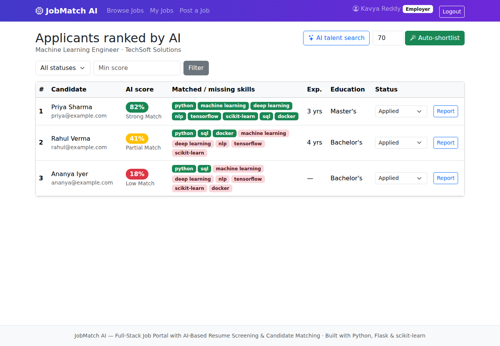

---

## 1. Quick start (2 minutes)

You need Python 3.10 or newer.

```bash
cd job_portal_python
python -m venv venv
# Windows: venv\Scripts\activate      macOS/Linux: source venv/bin/activate
pip install -r requirements.txt

python seed.py      # creates the database with demo users, jobs and applications
python run.py       # open http://127.0.0.1:5000
```

**Demo accounts** (password `password123` for all):

| Role | Email |
| --- | --- |
| Admin | admin@jobmatch.ai |
| Employer | hr@techsoft.com, talent@cloudnine.io |
| Candidate | priya@example.com, rahul@example.com, ananya@example.com, arjun@example.com |

Sample resumes you can upload during a live demo are in `sample_resumes/`.

Run the tests:

```bash
python -m pytest -v
```

---

## 2. Features

### Candidate (job seeker)
- Register and log in, then build a profile with headline, location and skills.
- Upload a resume (**PDF / DOCX / TXT**). The AI resume analysis shows the extracted skills, years of experience and education level.
- Search and filter jobs by keyword, location and job type.
- See a **predicted AI match score** before applying, with the skills you are missing.
- Apply with one click. The application is screened instantly and you get a screening report.
- **AI job recommendations** on the dashboard: open jobs ranked by how well they fit your resume.
- Track application status (applied → shortlisted → interview → hired / rejected) and withdraw an application.

### Employer (recruiter)
- Post, edit, close/reopen and delete jobs, with required skills and minimum experience.
- **Applicants ranked by AI score**, showing matched and missing skills, experience and education. Filter by status or minimum score.
- **Auto-shortlist**: one click shortlists every applicant above a score threshold.
- **AI talent search**: ranks *every* candidate on the platform for a job, including people who haven't applied, with an "Invite" button.
- A detailed screening report per applicant, including the extracted resume text and a resume download.
- Editing a job's requirements **re-screens all its applicants** automatically.

### Admin
- Platform statistics, an AI score distribution chart and applications by status.
- User management: search, filter by role, activate/deactivate, delete. Deleting a user also deletes their jobs and applications.
- Moderation of all jobs.

### Security
Passwords are hashed with Werkzeug (PBKDF2/scrypt). All forms are CSRF-protected (Flask-WTF). Access is controlled by role through a `@role_required` decorator, plus ownership checks so an employer can only see their own applicants. Uploads are limited to 5 MB and to the PDF/DOCX/TXT extensions, and filenames are sanitised. Deactivated accounts cannot log in.

---

## 3. System architecture

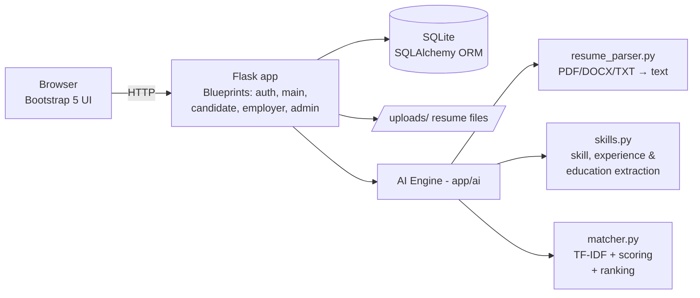

### Project structure

```
job_portal_python/
├── run.py                 entry point (python run.py)
├── config.py              settings (DB path, upload limits, secret key)
├── seed.py                demo data loader
├── requirements.txt
├── app/
│   ├── __init__.py        app factory, extensions, error pages
│   ├── models.py          User, Job, Application tables
│   ├── utils.py           role_required decorator, resume upload handling
│   ├── auth.py            register / login / logout
│   ├── main.py            home, job search, job details, apply
│   ├── candidate.py       dashboard, recommendations, profile, reports
│   ├── employer.py        job CRUD, ranked applicants, talent search, auto-shortlist
│   ├── admin.py           stats, user and job management
│   ├── ai/
│   │   ├── resume_parser.py   text extraction from PDF / DOCX / TXT
│   │   ├── skills.py          skill dictionary, synonyms, implied skills, experience & education regex
│   │   └── matcher.py         scoring, candidate ranking, job recommendation
│   ├── templates/         Jinja2 HTML pages
│   └── static/            CSS + bundled Bootstrap
├── sample_resumes/        resumes for demos
├── screenshots/           screenshots of every page
└── tests/                 pytest: AI engine unit tests + full web-app tests
```

### Database design (ER diagram)

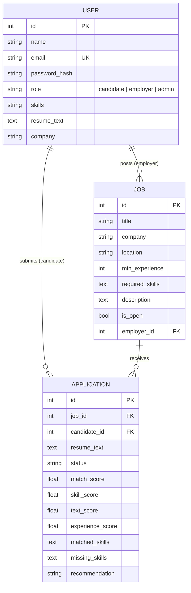

A unique constraint on `(job_id, candidate_id)` stops a candidate from applying twice to the same job.

---

## 4. The AI screening & matching algorithm

The code is in `app/ai/matcher.py`. For a resume *R* and a job *J*:

**Step 1: Resume parsing.** The resume is converted to plain text with `pypdf` for PDF files, `python-docx` for DOCX files, and a direct read for TXT files.

**Step 2: Information extraction** (`skills.py`):
- **Skills**: matched against a dictionary of about 100 technical and soft skills using regex word boundaries. The matching handles symbols such as `C++`, `C#` and `Node.js`.
- **Synonyms**: abbreviations map to a canonical skill, e.g. `js → javascript`, `k8s → kubernetes`, `sklearn → scikit-learn`.
- **Implied skills**: knowing a specific tool implies the broader skill, e.g. `MySQL ⇒ SQL`, `Django ⇒ Python`, `TensorFlow ⇒ Deep Learning ⇒ Machine Learning`.
- **Ambiguous words** such as "C", "R" and "Go" only count when they appear in a list ("Languages: Python, C, Go"), so ordinary English isn't misread as a skill.
- **Experience**: a regex finds phrases like "4+ years of experience" and takes the largest value.
- **Education**: the highest degree mentioned, detected from patterns such as PhD, M.Tech/MCA/MBA, B.Tech/B.E./BCA and Diploma.

**Step 3: Three sub-scores (0–100):**

| Signal | Weight | Formula |
| --- | --- | --- |
| Skill match | 50% | (job skills found in resume or profile) / (total job skills) × 100 |
| Text similarity | 30% | TF-IDF vectors (unigrams + bigrams, English stop-words removed, sublinear TF) of the resume and the job text, then **cosine similarity**, rescaled so that a cosine of 0.5 or more counts as 100% |
| Experience fit | 20% | min(1, candidate years / required years) × 100, or 100 if the job needs 0 years |

**Step 4: Final score.**

```
score = 0.5 × skill + 0.3 × text + 0.2 × experience
```

If the resume doesn't mention years of experience, the 20% experience weight is redistributed proportionally over the other two signals: `score = (0.5 × skill + 0.3 × text) / 0.8`. This way a candidate is never penalised for leaving something out.

**Step 5: Label.** 75 or more is **Strong Match**, 50 or more is **Good Match**, 30 or more is **Partial Match**, and anything lower is **Low Match**.

**Cosine similarity**, for reference:

```
cos(A, B) = (A · B) / (‖A‖ × ‖B‖)
TF-IDF(t, d) = tf(t, d) × idf(t),   idf(t) = ln((1 + n) / (1 + df(t))) + 1
```

**The same function powers three features:**
1. **Screening**: score one application when it is submitted.
2. **Candidate ranking / talent search**: score every candidate for one job and sort (`rank_candidates`).
3. **Job recommendation**: score every open job for one candidate and sort (`recommend_jobs`).

Example scores from the demo data:

| Job | Candidate | Score | Label |
| --- | --- | --- | --- |
| Machine Learning Engineer | Priya (Data Scientist) | 82 | Strong Match |
| Machine Learning Engineer | Rahul (Full-stack dev) | 41 | Partial Match |
| Machine Learning Engineer | Ananya (fresher) | 18 | Low Match |
| Data Analyst – Graduate Trainee | Ananya (fresher) | 80 | Strong Match |
| DevOps Engineer | Arjun (DevOps) | 84 | Strong Match |

---

## 5. Screenshots

| | |
| --- | --- |
| Home 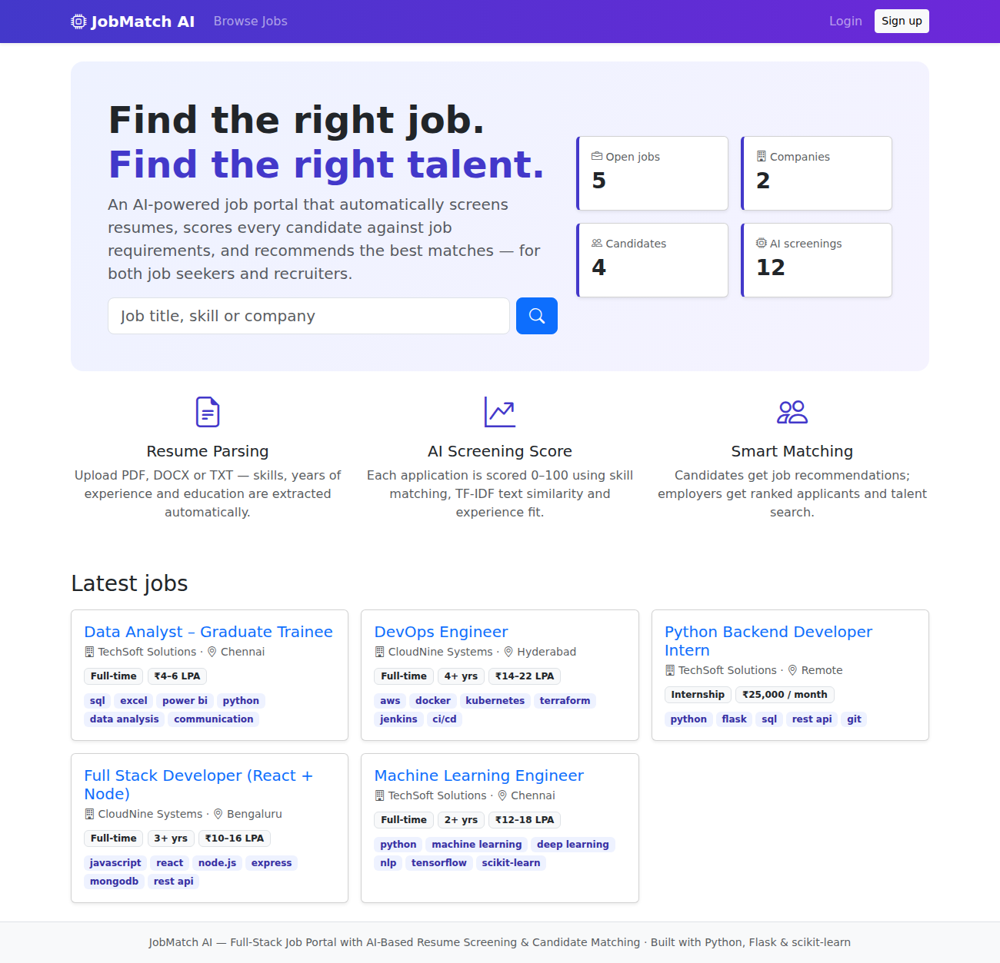 | Candidate dashboard with AI recommendations 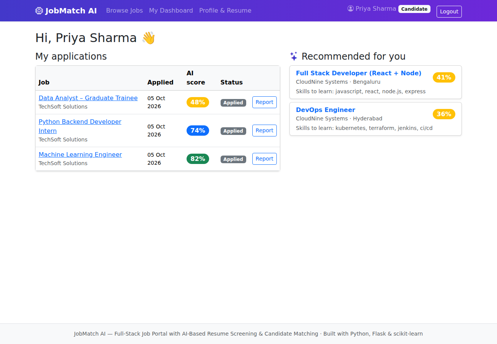 |
| AI resume analysis 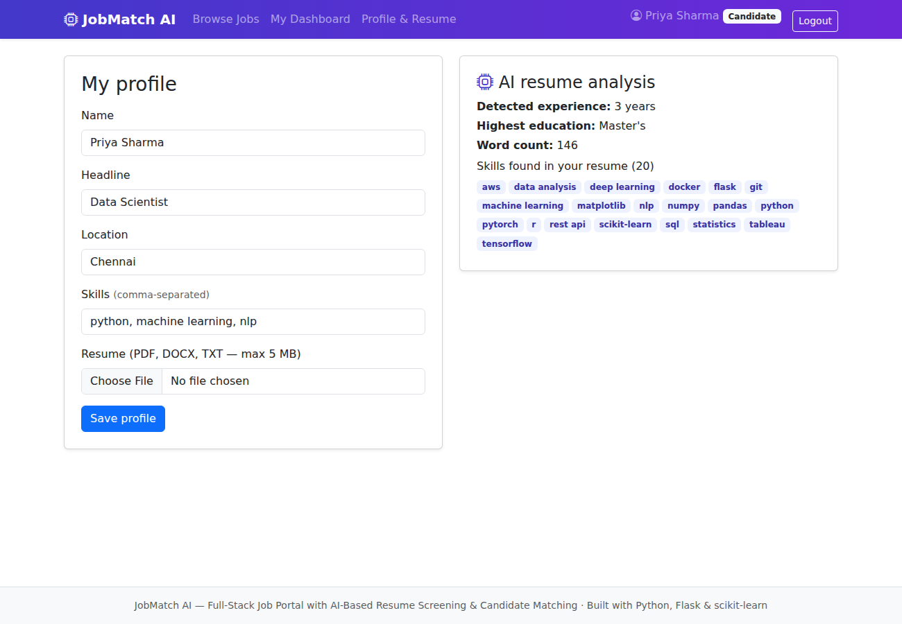 | Predicted match before applying 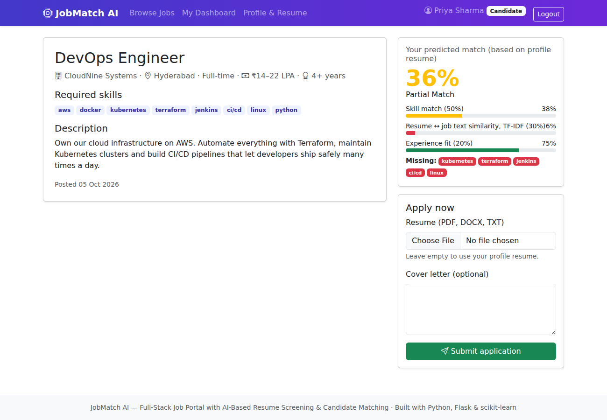 |
| Candidate screening report 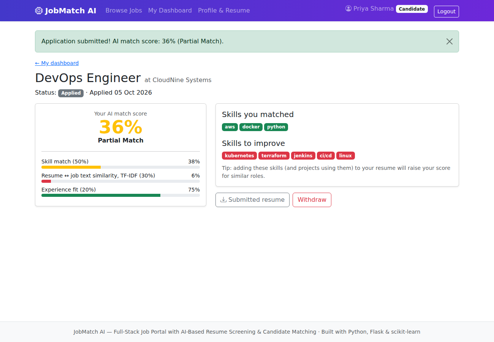 | Employer dashboard 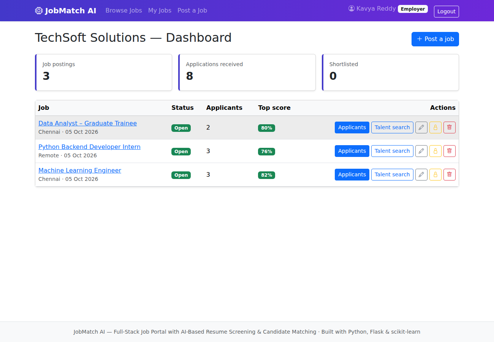 |
| Ranked applicants  | Applicant screening report 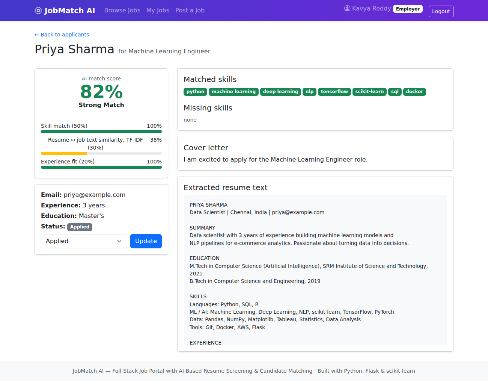 |
| AI talent search 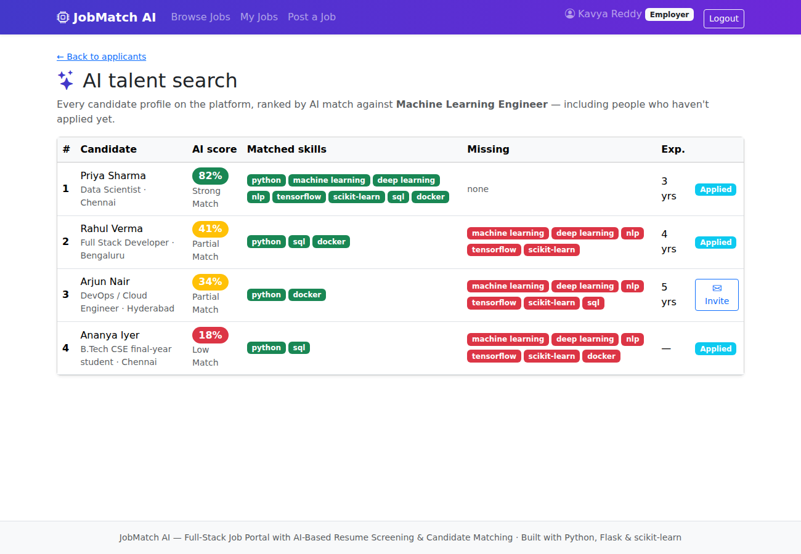 | Admin dashboard 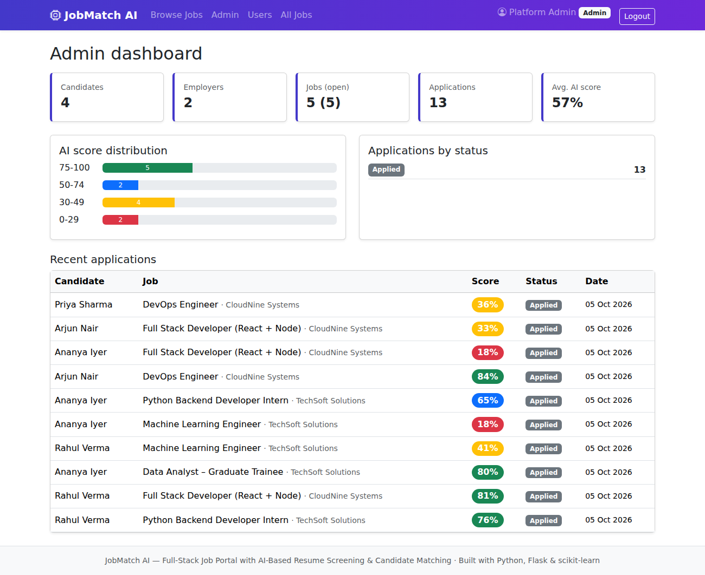 |

---

## 6. Testing

`tests/test_ai.py` contains unit tests for the AI engine. They cover skill aliases, implied skills, ambiguous words, experience and education extraction, TF-IDF bounds, score ordering, weight redistribution, ranking, recommendation, and PDF/DOCX/TXT parsing.

`tests/test_app.py` contains end-to-end web tests using Flask's test client. They cover:
- registration and login, including that admin can't self-register
- role-based access
- posting a job
- applying with AI screening, including duplicate prevention and file-type validation
- the ranked applicant order
- status updates and auto-shortlist
- isolation between employers
- talent search and recommendations
- profile resume analysis
- admin deactivation and job search

```
$ python -m pytest -q
24 passed
```

---

## 7. Possible future enhancements

- Semantic embeddings (e.g. Sentence-BERT) or an LLM in place of TF-IDF, so that synonyms are understood by meaning.
- Email notifications for status changes (Flask-Mail).
- Interview scheduling and in-app messaging.
- OCR (Tesseract) for scanned image resumes.
- A REST API and a mobile app, plus deployment with Gunicorn and PostgreSQL.
- Bias auditing: hiding names and genders during screening.

---

## 8. Viva / exam quick answers

- **Why TF-IDF?** It weights words that are important to a document and rare across documents, so generic words count less. Cosine similarity then measures the angle between two vectors, which makes it independent of resume length.
- **Why not only keyword matching?** Keyword matching misses context. Text similarity rewards resumes that are about the same domain even when exact skill names differ.
- **Why a weighted hybrid score?** Each signal covers a weakness of another: skills check exact requirements, TF-IDF checks topical relevance, and experience checks seniority. The weights are easy to explain and to tune.
- **How do you avoid penalising missing data?** When experience isn't mentioned, its weight is redistributed over the other signals instead of counting as zero.
- **How is the app secured?** Passwords are hashed, forms are CSRF-protected, access is checked by role and by ownership, uploads are validated, and filenames are sanitised.
- **Is this "AI"?** Yes. It is classical NLP and information retrieval: text vectorisation, cosine similarity, rule-based named-entity extraction, and ranking. It is explainable, so recruiters can see *why* a candidate scored the way they did, which matters for fair hiring.
